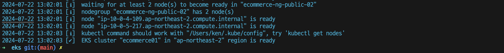
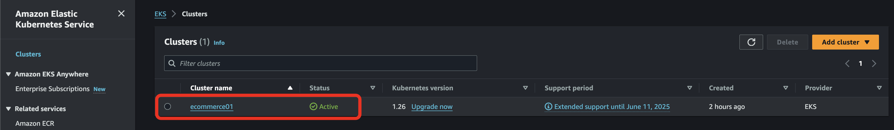
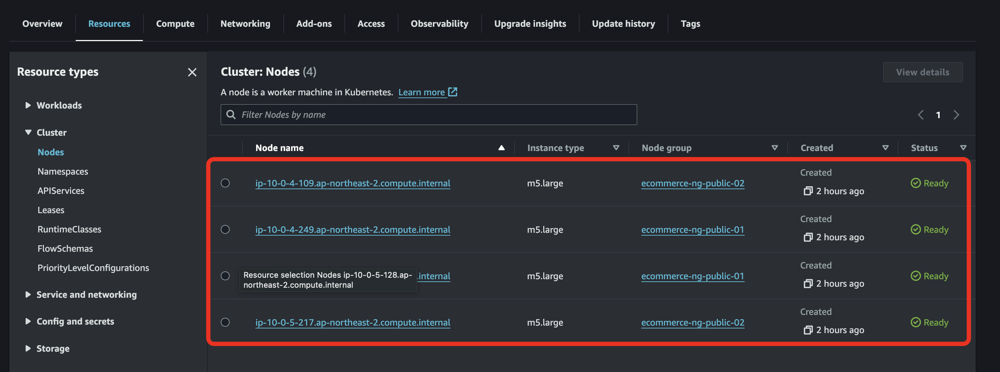
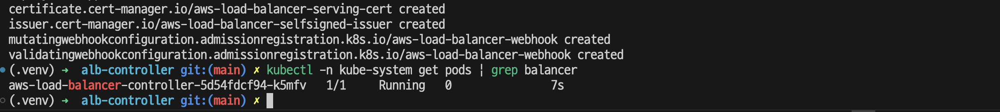

# EKS Cluster 생성


```bash
# aws 계정(profile 등) 설정
# cluster.yaml 에 cluster id, subnet id 수정
eksctl create cluster --config-file=cluster.yaml
```





# AWS Ingress 생성
export ekscluster_name=ecommerce01
IAM OIDC Provider 생성
eksctl utils associate-iam-oidc-provider \
    --region ap-northeast-2 \
    --cluster ${ekscluster_name} \
    --approve


# ALB Load Balancer Controller 의 IAM Policy Download
mkdir alb-controller; cd alb-controller
export ALB_CONTROLLER_VERSION=2.5.2
curl -o iam_policy.json https://raw.githubusercontent.com/kubernetes-sigs/aws-load-balancer-controller/v$ALB_CONTROLLER_VERSION/docs/install/iam_policy.json

# AWSLoadBalancerControllerIAMPolicy IAM 정책 생성
aws iam create-policy \
    --policy-name ${ekscluster_name}-AWSLoadBalancerControllerIAMPolicy \
    --policy-document file://./iam_policy.json

# AWS LoadBalancer Controller IAM 역할 및 Service Account 생성
export ACCOUNT_ID=531744930393

eksctl create iamserviceaccount \
--cluster=${ekscluster_name} \
--namespace=kube-system \
--name=aws-load-balancer-controller \
--attach-policy-arn=arn:aws:iam::${ACCOUNT_ID}:policy/${ekscluster_name}-AWSLoadBalancerControllerIAMPolicy \
--override-existing-serviceaccounts \
--region ap-northeast-2 \
--approve

# 확인
kubectl get serviceaccounts -n kube-system aws-load-balancer-controller -o yaml

# 인증서 관리자 설치
export CERTMGR_VERSION=1.12.2
kubectl apply --validate=false -f https://github.com/jetstack/cert-manager/releases/download/v$CERTMGR_VERSION/cert-manager.yaml
kubectl -n cert-manager get pods


# AWS Loadbalancer Controller Pod 설치
wget https://github.com/kubernetes-sigs/aws-load-balancer-controller/releases/download/v2.5.2/v2_5_2_full.yaml

아래 `<INSERT_CLUSTER_NAME>` 에 cluster id 수정
```yml
### cluster name을 eksworkshop 또는 현재 실행 중인 Cluster name으로 변경합니다.
apiVersion: apps/v1
kind: Deployment
. . .
name: aws-load-balancer-controller
namespace: kube-system
spec:
    . . .
    template:
        spec:
            containers:
                - args:
                    - --cluster-name=<INSERT_CLUSTER_NAME>
```

아래 섹션 삭제
```yml
apiVersion: v1
kind: ServiceAccount
metadata:
  labels:
    app.kubernetes.io/component: controller
    app.kubernetes.io/name: aws-load-balancer-controller
  name: aws-load-balancer-controller
  namespace: kube-system
---
```

설치
kubectl apply -f v2_5_2_full.yaml
kubectl -n kube-system get pods | grep balancer
