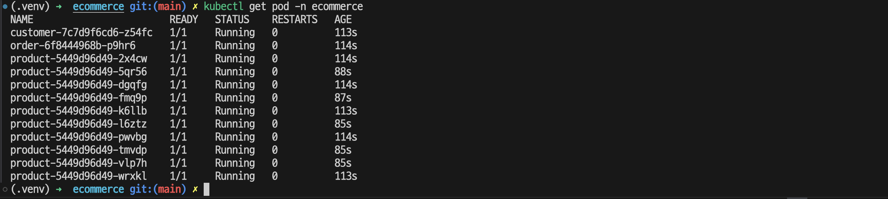
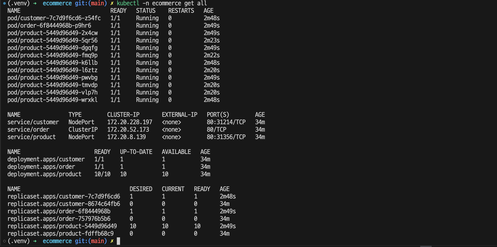
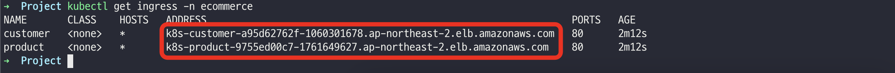

`db-connect-config.yaml` 파일에 db 정보 입력
`ecommerce.yaml` 파일에 subnet id 변경

kubectl create namespace ecommerce
kubectl get ns

kubectl delete configmap db-connect-config  -n ecommerce
kubectl apply -f db-connect-config.yaml -n ecommerce
kubectl get configmap db-connect-config -n ecommerce -o yaml

kubectl delete po --all -n ecommerce
kubectl apply -f ecommerce.yaml
kubectl get pod -n ecommerce

kubectl -n ecommerce get all

kubectl -n ecommerce get ingress

ingress 관련 log
kubectl get pods --all-namespaces
kubectl logs aws-load-balancer-controller-6ff97cb4c6-6wnm5  -n kube-system

pods 관련 log
kubectl get pods --namespace ecommerce
kubectl logs customer-7c7d9f6cd6-vgmrb --namespace ecommerce