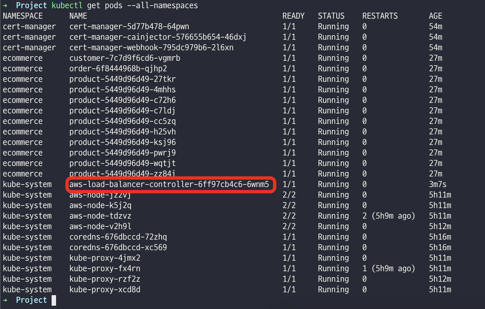

- [EKS 내 Application POD 실행](#eks-내-application-pod-실행)
    - [Database 정보 및 yaml 파일 수정](#database-정보-및-yaml-파일-수정)
    - [namespace 생성](#namespace-생성)
    - [configmap 생성](#configmap-생성)
    - [pod 생성](#pod-생성)
    - [결과 확인](#결과-확인)
    - [ingress 관련 log](#ingress-관련-log)
    - [pods 관련 log](#pods-관련-log)


# EKS 내 Application POD 실행

### Database 정보 및 yaml 파일 수정
- `db-connect-config.yaml` 파일에 db 정보 입력
- `ecommerce.yaml` 파일에 subnet id 변경

### namespace 생성
```bash
kubectl create namespace ecommerce
kubectl get ns
```

### configmap 생성
```bash
kubectl delete configmap db-connect-config  -n ecommerce
kubectl apply -f db-connect-config.yaml -n ecommerce
kubectl get configmap db-connect-config -n ecommerce -o yaml
```

### pod 생성
```bash
kubectl delete po --all -n ecommerce
kubectl apply -f ecommerce.yaml
```

### 결과 확인
```bash
kubectl get pod -n ecommerce
kubectl -n ecommerce get all
kubectl -n ecommerce get ingress
```


### ingress 관련 log
```bash
kubectl get pods --all-namespaces
kubectl logs aws-load-balancer-controller-6ff97cb4c6-6wnm5  -n kube-system
```


### pods 관련 log
```bash
kubectl get pods --namespace ecommerce
kubectl logs customer-7c7d9f6cd6-vgmrb --namespace ecommerce
```