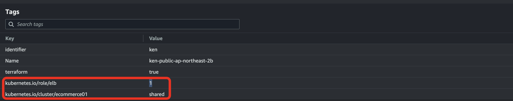
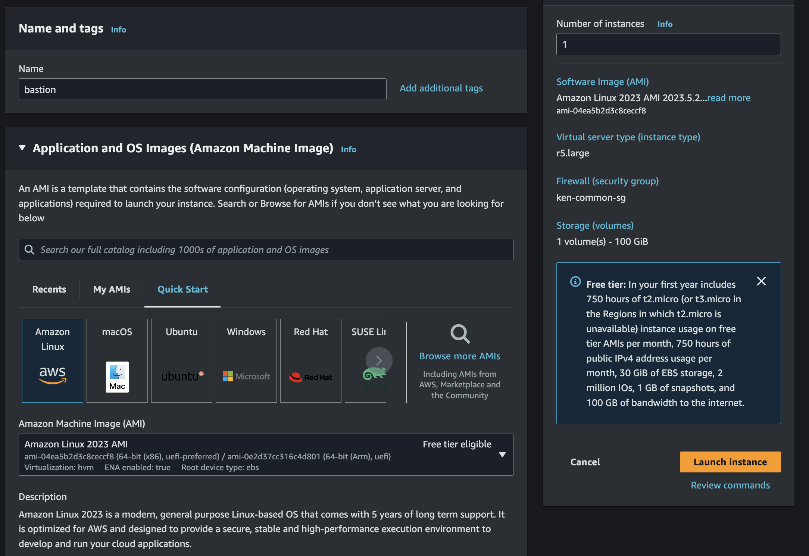
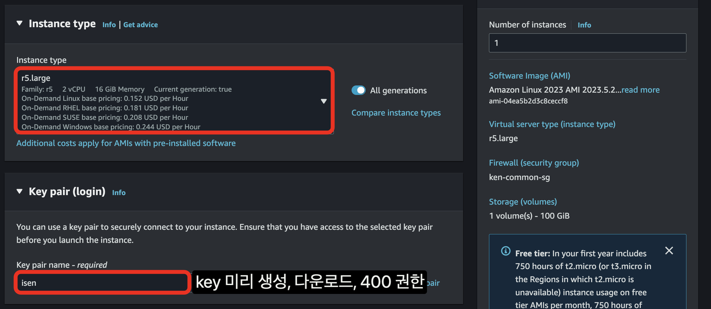
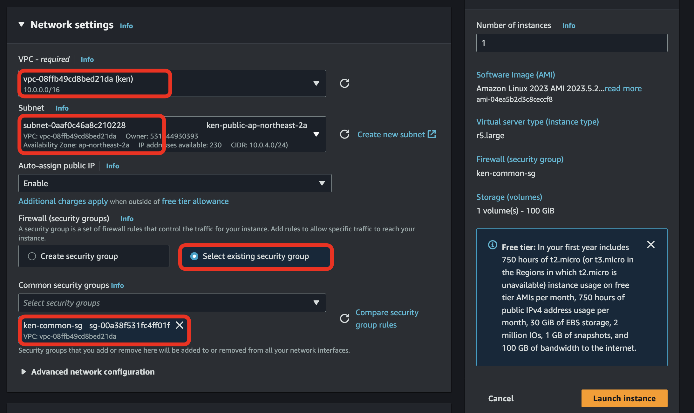
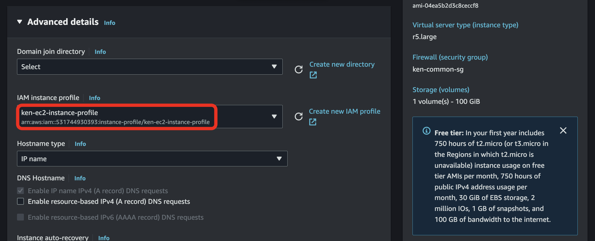
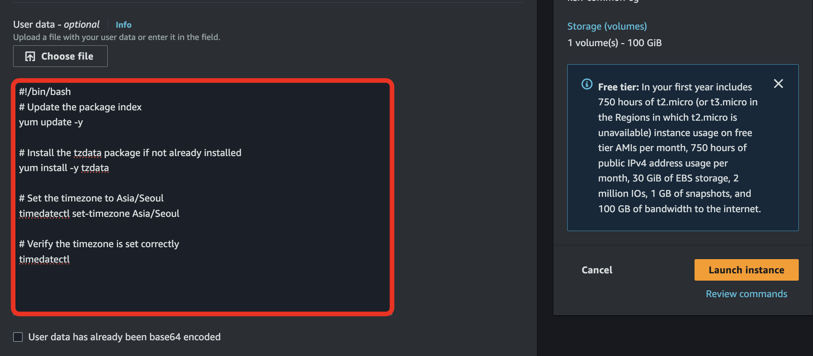
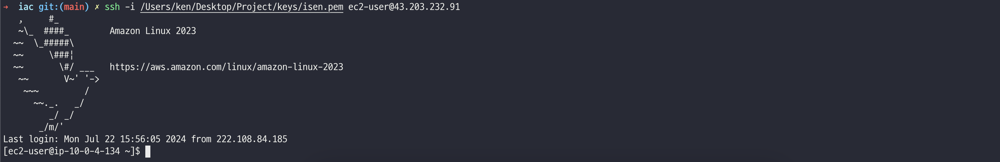

terraform 수행
```bash
# aws 환경 설정(프로파일 등)
tf plan
tf apply
```

eks 활용을 위해 subnet tag 설정
각 public subnet 에 아래 테그 지정
- kubernetes.io/cluster/ecommerce01 : shared
- kubernetes.io/role/elb : 1


bastion 생성




user data
```bash
#!/bin/bash
# Update the package index
yum update -y

# Install the tzdata package if not already installed
yum install -y tzdata

# Set the timezone to Asia/Seoul
timedatectl set-timezone Asia/Seoul

# Verify the timezone is set correctly
timedatectl
```


bastion에 ssh 접속
ssh -i [KEY PATH] ec2-user@[PUBLIC IP]
