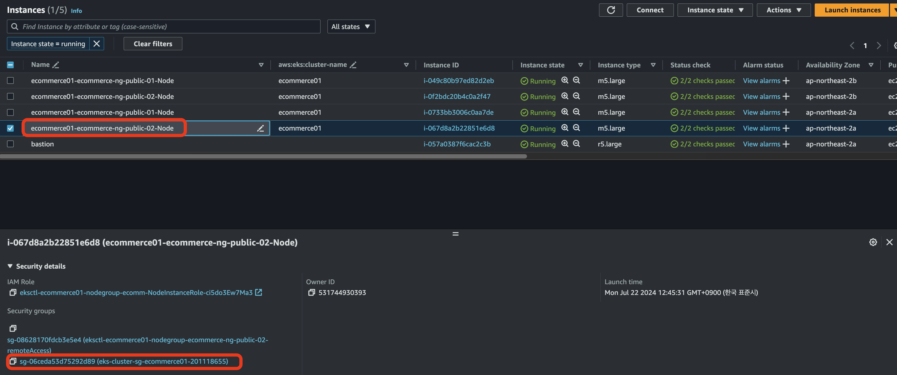
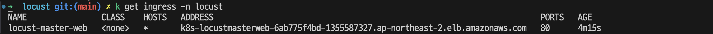
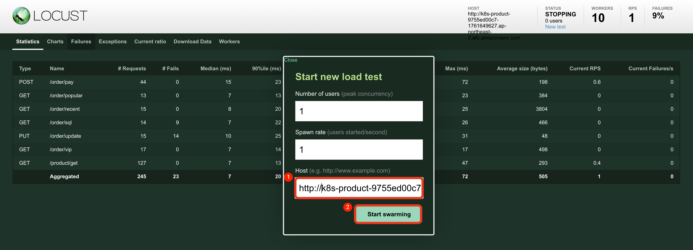
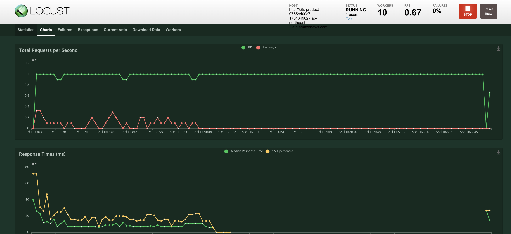

- [Locust Deploy](#locust-deploy)
    - [Deploy](#deploy)
    - [Application URL 확인](#application-url-확인)
    - [Locust URL 확인/접속](#locust-url-확인접속)
    - [HOST 에 Application URL 입력](#host-에-application-url-입력)


# Locust Deploy

### Deploy
```bash
kubectl create namespace locust
kubectl delete configmap locust-config -n locust
kubectl create configmap locust-config --from-file=../../source/locust/locust-tasks/configs -n locust
kubectl delete -f deployment.yaml -n locust
kubectl apply -f deployment.yaml -n locust
kubectl apply -f ingress.yaml -n locust
kubectl apply -f service.yaml -n locust
```

### Application URL 확인
```bash
k get ingress -n ecommerce
```

### Locust URL 확인/접속
접속 오류 시 EKS Node Security Group 에 80 포트 방화벽 허용

```bash
k get ingress -n locust
```


### HOST 에 Application URL 입력 
(http://k8s-product-xx-xx.ap-northeast-2.elb.amazonaws.com)


