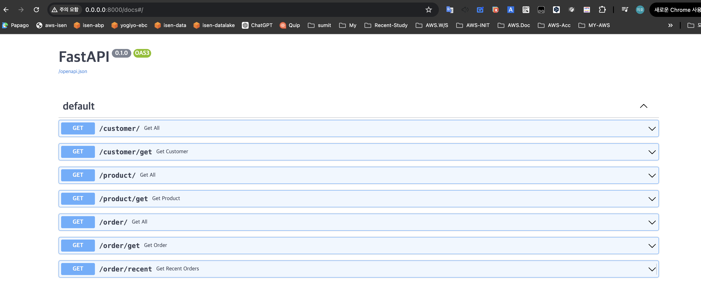

### MAC Local 에서 실행
```bash
export DBUSER="admin"
export PASSWORD="Admin1234"
export PRIMARY_HOST="0.0.0.0"
export READONLY_HOST="0.0.0.0"
export PRIMARY_PORT=33061
export READONLY_PORT=33061
export PRIMARY_DBNAME="ecommerce"
export READONLY_DBNAME="ecommerce"
export HOST_NAME=$(hostname)
export HOST_IP=$(hostname -I | awk '{print $1}')
# app 실행
uvicorn main:app --host 0.0.0.0 --port 8000 --reload
```



### EKS 실행을 위해 docker img 배포
```bash
docker build --no-cache -t color275/ecommerce-linux --platform linux/amd64 .
# docker build -t color275/ecommerce-linux --platform linux/amd64 .
docker push color275/ecommerce-linux
```


### old
```
export DBUSER="appuser"
export PASSWORD="Appuser12#$"
export PRIMARY_HOST="localhost"
export READONLY_HOST="localhost"
export PORT="3306"
export DBNAME="ecommerce"
uvicorn main:app --port 8000 --reload
```